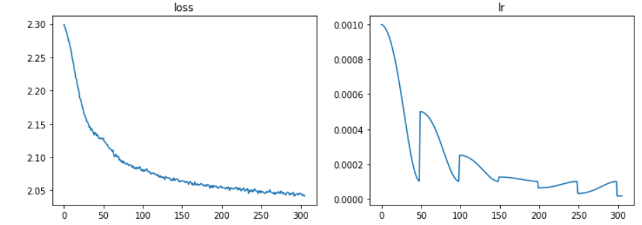
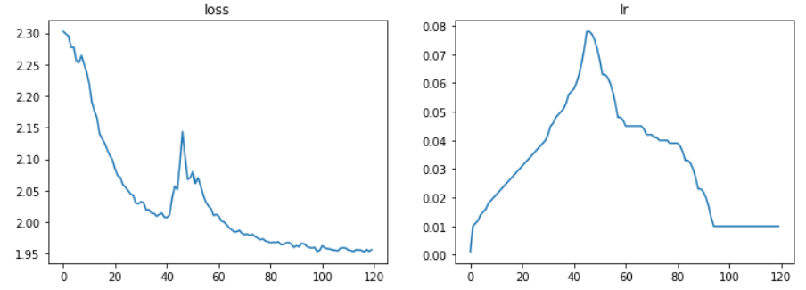
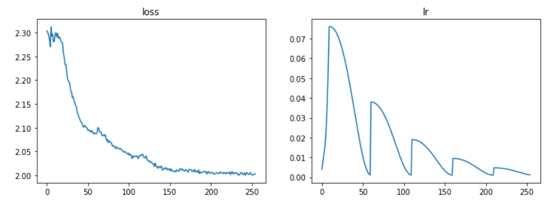

# The LR scheduler introduction
### CosinePowerAnnealing

### TriangleScheduler
Simple class to linearly increase lr until loss stops decreasing with a certain grace period, then, linearly decrease lr.

### TriangleUpThenCosinePower

